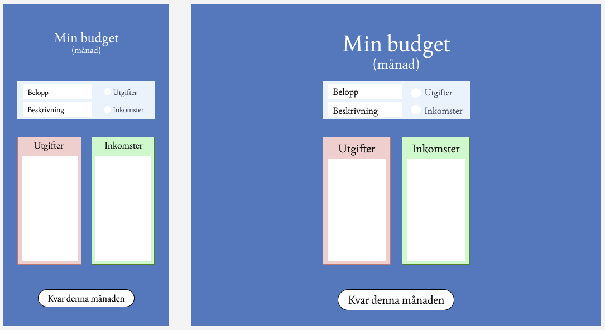
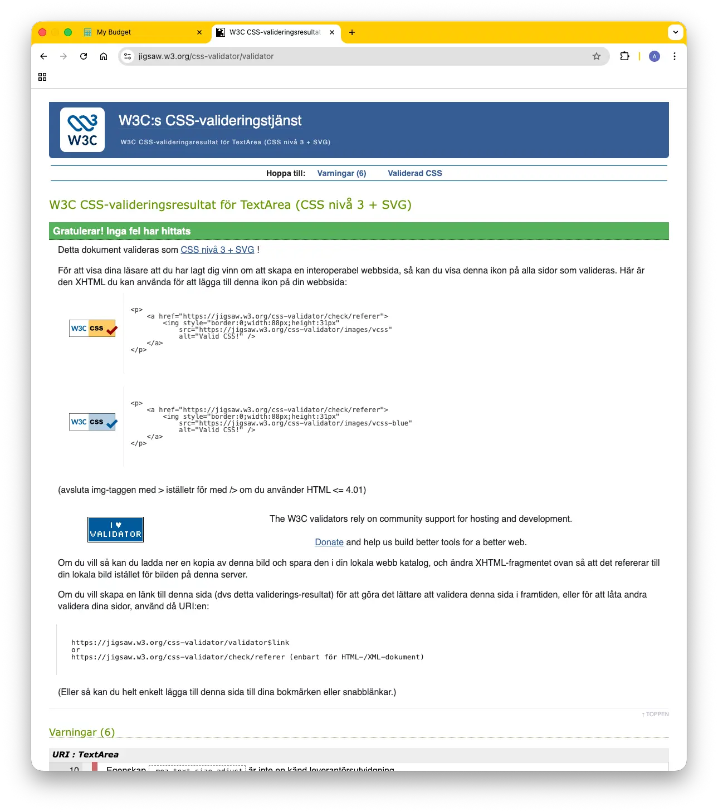
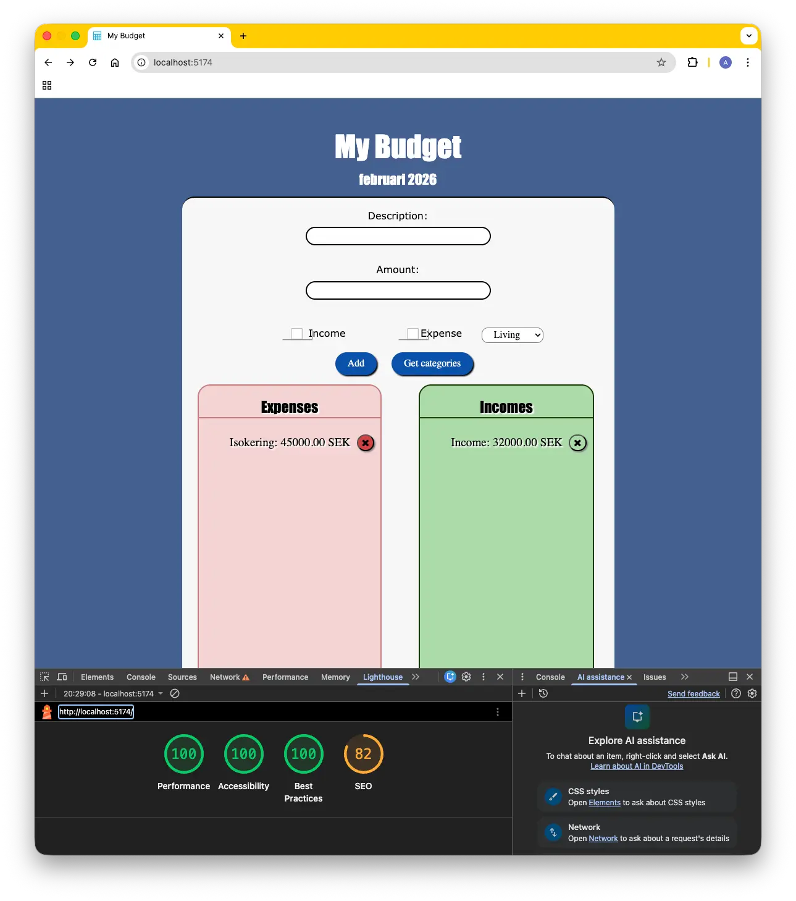
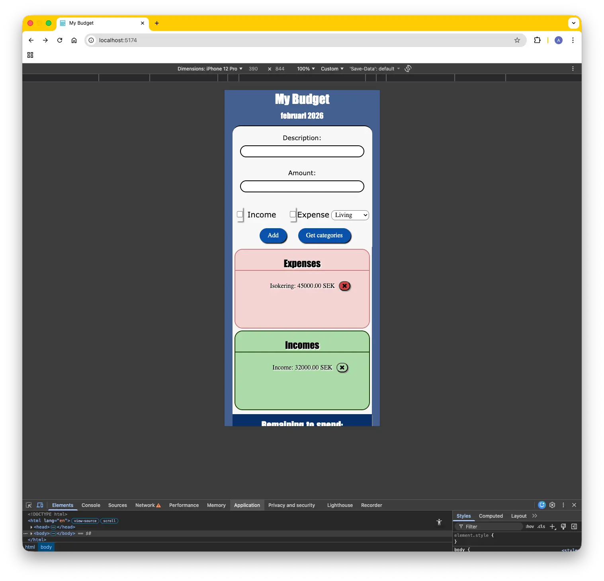
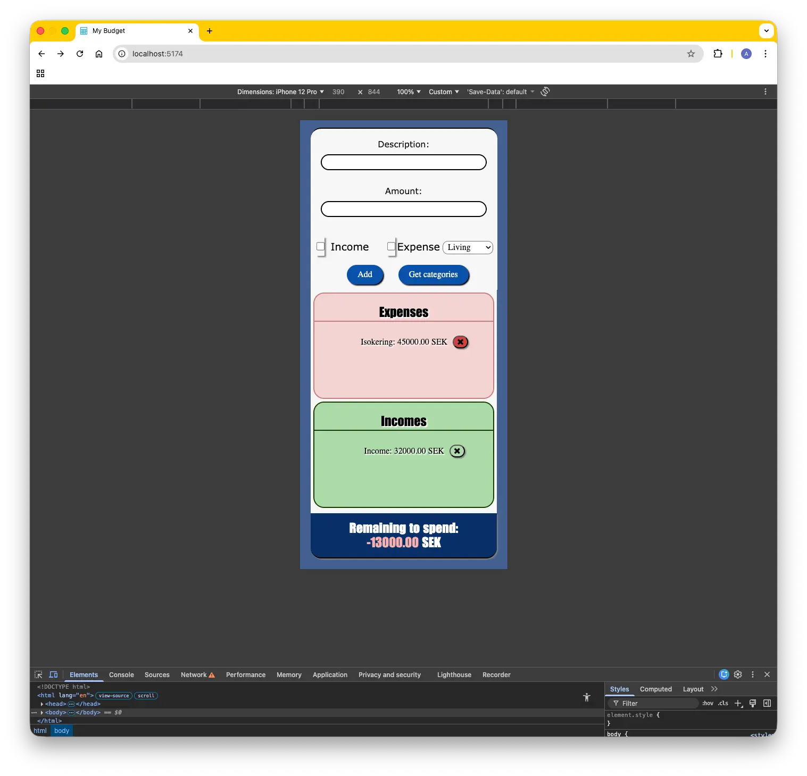
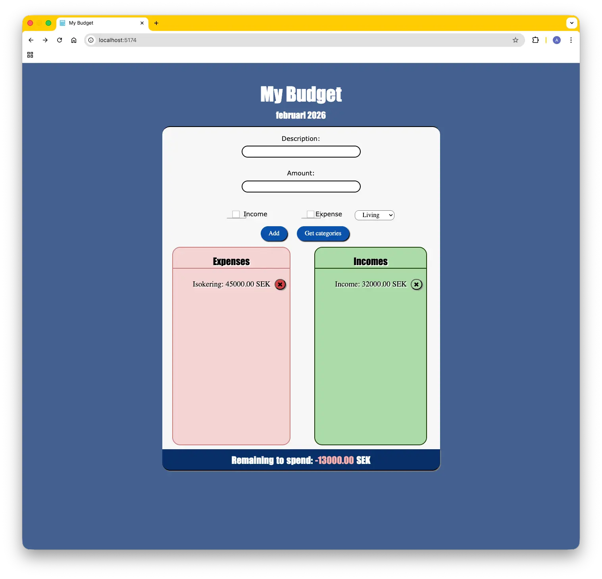

This is an app to help you handle your budget.

# My Wireframe

## This was my initial design for the website but when I started to style it with CSS I realized that the expenses and incomes boxes won't work for both the mobile and desktop layout. So i decided to change the layout of the mobile version to make it more a11y.

### During the development of this project I have used the HTML and CSS validators to check for errors in my code. I have also used Lighthouse to check for accessibility, performance, best practices and SEO. I have made sure to fix any issues that were found in the validators and Lighthouse reports except for the SEO issues yet.

#### I have also made sure to use semantic HTML elements and to add ARIA roles and labels where necessary to make the website more accessible. I have also made sure to use a color scheme that has enough contrast to make it easier for users with visual impairments to read the content. I have also made sure to use a responsive design to make the website look good on both mobile and desktop devices.

##### This is the how the website looks on mobile devices:

 

##### This is how the website looks on desktop devices:

